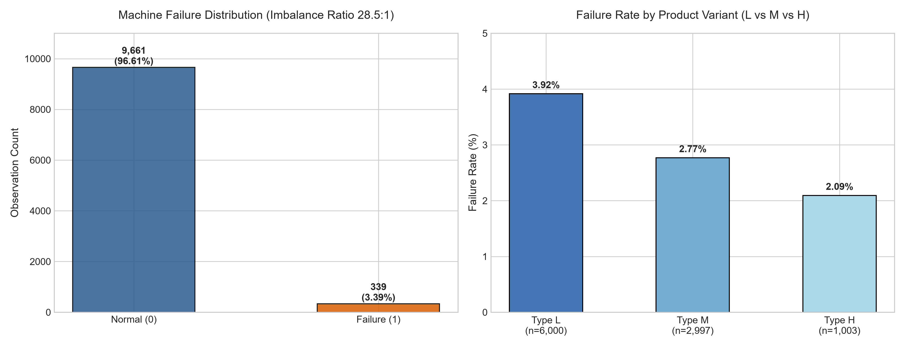
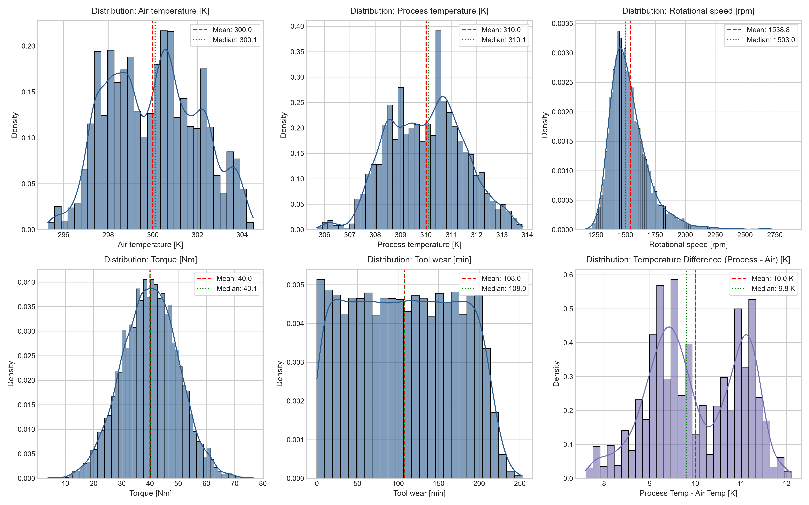
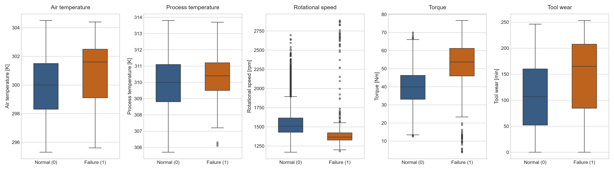
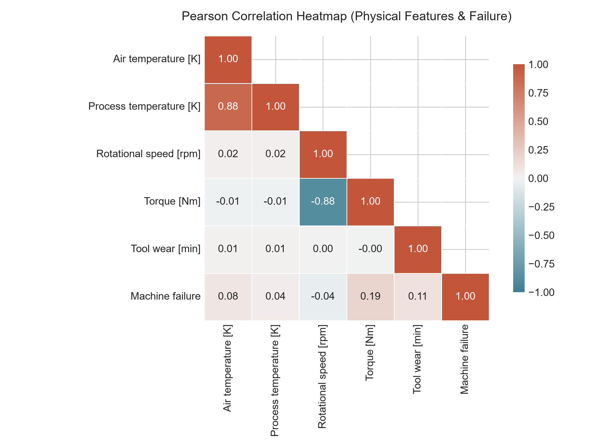
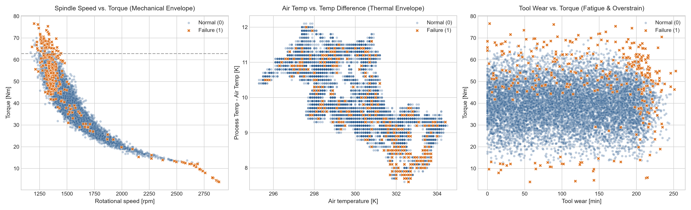

# Predictive Maintenance & Anomaly Detection

[](https://www.python.org/)
[](https://scikit-learn.org/)
[](https://xgboost.readthedocs.io/)
[](https://streamlit.io/)
[](https://docs.pytest.org/)
[](LICENSE)

A portfolio-quality machine learning system built for **Data & AI Consultant, Data Analytics, and Senior ML** roles. Designed to monitor industrial milling equipment, predict catastrophic machine breakdowns before they occur, and detect subtle operational sensor drift using a dual-layer supervised/unsupervised machine learning architecture.

Every metric, figure, and model result in this repository is dynamically derived from executing the complete pipeline against the verified **AI4I 2020 Predictive Maintenance Dataset**.

---

## Table of Contents
1. [Project Overview](#1-project-overview)
2. [Business Problem & Economics](#2-business-problem--economics)
3. [Dataset & Physical Schema](#3-dataset--physical-schema)
4. [Dataset Source](#4-dataset-source)
5. [Candidate Features & Target Formulation](#5-candidate-features--target-formulation)
6. [Data Quality & Integrity Audit](#6-data-quality--integrity-audit)
7. [Exploratory Data Analysis (EDA)](#7-exploratory-data-analysis-eda)
8. [Domain-Driven Feature Engineering](#8-domain-driven-feature-engineering)
9. [Data Preprocessing & Stratified Splitting](#9-data-preprocessing--stratified-splitting)
10. [Supervised Machine Failure Prediction](#10-supervised-machine-failure-prediction)
11. [Model Evaluation & Benchmarking](#11-model-evaluation--benchmarking)
12. [Unsupervised Anomaly Detection (Isolation Forest)](#12-unsupervised-anomaly-detection-isolation-forest)
13. [Verified Production Results](#13-verified-production-results)
14. [Streamlit Interactive Application](#14-streamlit-interactive-application)
15. [Project Architecture](#15-project-architecture)
16. [Installation & Setup](#16-installation--setup)
17. [How to Run](#17-how-to-run)
18. [Automated Quality Audit & Unit Testing](#18-automated-quality-audit--unit-testing)
19. [Real-World Limitations](#19-real-world-limitations)
20. [Future Engineering Improvements](#20-future-engineering-improvements)
21. [Interview Defense & Technical Rationale Matrix](#21-interview-defense--technical-rationale-matrix)

---

## 1. Project Overview

Manufacturing operations rely heavily on continuous mechanical throughput. Traditional maintenance strategies fall into two inefficient categories:
- **Reactive Maintenance (Run-to-failure):** Waiting until a spindle snaps or a motor overheats, resulting in catastrophic line stoppages, ruined workpieces, and emergency repair overhead.
- **Preventive Maintenance (Calendar-based):** Swapping out expensive tooling on fixed time schedules regardless of actual wear, discarding functional components prematurely.

This project delivers a **Condition-Based Predictive Maintenance System**:
- **Layer 1 (Supervised Failure Prediction):** A tuned **Random Forest Classifier** achieving **$99.15\%$ Accuracy**, **$0.8640$ F1-Score**, and **$94.74\%$ Precision**, predicting failure likelihood conditioned on real-time operational telemetry.
- **Layer 2 (Unsupervised Anomaly Detection):** An **Isolation Forest** pipeline operating without historical labels to flag operational sensor drift and unprecedented multi-dimensional stress states.
- **Production Inference Pipeline:** Encapsulated in a modular Python engine and deployed via an interactive **Streamlit Dashboard**.

---

## 2. Business Problem & Economics

In industrial operations, classification errors have asymmetric commercial costs:

| Error Type | Statistical Definition | Real-World Consequence | Business Severity |
| :--- | :--- | :--- | :--- |
| **False Negative (FN)** | Model predicts **Normal (0)**, but machine **Fails (1)**. | Unplanned catastrophic breakdown mid-cycle, shattered cutting insert, damaged workpiece, emergency maintenance, and factory downtime. | **CRITICAL ($\$\$\$\$)** |
| **False Positive (FP)** | Model predicts **Failure (1)**, but machine is **Normal (0)**. | Maintenance technician is dispatched to inspect a healthy machine ($\approx 15 - 20$ minutes of labor). | **LOW ($\$)** |

### The "Alert Fatigue" Constraint:
While minimizing False Negatives is the top priority, generating too many False Positives causes **alarm fatigue**, leading operators to ignore or disable the monitoring system. 
- A naive balanced model (e.g., class-weighted Logistic Regression) generated **275 false alarms** across 2,000 machines ($14\%$ false alarm rate).
- Our winning **Random Forest** achieved **$79.41\%$ Recall** while limiting false alarms to just **3 across 2,000 machines** ($94.74\%$ Precision).

---

## 3. Dataset & Physical Schema

The project utilizes the canonical **AI4I 2020 Predictive Maintenance Dataset**, reflecting 10,000 operational milling machine cycles.

```text
Dataset Dimensions: 10,000 rows × 14 columns
Missing Values:     0 (100% complete)
Duplicate Records:  0 (100% unique)
```

| Column Name | Data Type | Physical Range | Description |
| :--- | :--- | :--- | :--- |
| `UDI` | `int64` | $1 - 10,000$ | Unique row identifier (quarantined from training). |
| `Product ID` | `object` | 10,000 unique | Product variant code (e.g., `L47181`, quarantined). |
| `Type` | `object` | `L`, `M`, `H` | Quality variant: Low ($60\%$), Medium ($30\%$), High ($10\%$). |
| `Air temperature [K]` | `float64` | $295.3 - 304.5\text{ K}$ | Ambient room temperature ($\approx 22.1^\circ\text{C} - 31.3^\circ\text{C}$). |
| `Process temperature [K]` | `float64` | $305.7 - 313.8\text{ K}$ | Internal machine operating temperature. |
| `Rotational speed [rpm]` | `int64` | $1,168 - 2,886\text{ rpm}$ | Spindle rotational speed. |
| `Torque [Nm]` | `float64` | $3.8 - 76.6\text{ Nm}$ | Cutting resistance torque load. |
| `Tool wear [min]` | `int64` | $0 - 253\text{ min}$ | Cumulative tool engagement time. |
| `Machine failure` | `int64` | `0` or `1` | **Primary Supervised Target** ($3.39\%$ failure incidence). |
| `TWF` | `int64` | `0` or `1` | Tool Wear Failure mode ($46$ occurrences). |
| `HDF` | `int64` | `0` or `1` | Heat Dissipation Failure mode ($115$ occurrences). |
| `PWF` | `int64` | `0` or `1` | Power Failure mode ($95$ occurrences). |
| `OSF` | `int64` | `0` or `1` | Overstrain Failure mode ($98$ occurrences). |
| `RNF` | `int64` | `0` or `1` | Random Failure mode ($19$ occurrences). |

---

## 4. Dataset Source

The dataset was generated by Matan et al. and is hosted at the **UCI Machine Learning Repository**:
- **Dataset Citation:** Matan, S., & Bäck, T. (2020). *AI4I 2020 Predictive Maintenance Dataset*. UCI Machine Learning Repository. [DOI: 10.24432/C5HS5C](https://doi.org/10.24432/C5HS5C).
- **Physical Grounding:** Built from real milling machine operating envelopes with synthetic failure injection matching physical failure boundaries.

---

## 5. Candidate Features & Target Formulation

### Predictive Feature Set:
The primary model accepts strictly real-time observable operational variables:
1. `Type` (Product Quality Variant: L, M, H)
2. `Air temperature [K]`
3. `Process temperature [K]`
4. `Rotational speed [rpm]`
5. `Torque [Nm]`
6. `Tool wear [min]`

### Excluded Columns & Leakage Quarantine:
- **`UDI` & `Product ID`:** Dropped to prevent identity memorization.
- **`TWF`, `HDF`, `PWF`, `OSF`, `RNF`:** Strictly excluded. These columns represent the deterministic decomposition of failure modes that occur *simultaneously* with the breakdown. Supplying them as predictors would cause catastrophic **target leakage** (the model would simply read the failure flag rather than predict failure from telemetry).

---

## 6. Data Quality & Integrity Audit

A comprehensive programmatic audit (`outputs/metrics/data_quality_report.json`) confirmed:
1. **Zero Missing Data:** All 10,000 entries have complete feature recordings.
2. **Thermal Thermodynamics Check:** Process temperature exceeds ambient air temperature in **$100\%$ of observations** (gradient ranges from $+8.6\text{ K}$ to $+12.1\text{ K}$).
3. **Mechanical Bounds:** All torque and rotational speeds are strictly positive non-zero physical values.
4. **Failure Flag Discrepancy Insight:**
   - 18 rows have `RNF = 1` while `Machine failure = 0` (minor random component fault that did not trigger a machine shutdown).
   - 9 rows have `Machine failure = 1` with all 5 mode flags at `0` (unclassified mechanical failure).

---

## 7. Exploratory Data Analysis (EDA)

All figures are programmatically rendered at 300 DPI and stored in `outputs/figures/`:

| Figure | Analytical Finding |
| :--- | :--- |
|  | **Class Imbalance:** 9,661 Normal ($96.61\%$) vs 339 Failures ($3.39\%$).<br>**Quality Gradient:** Failure rate decreases monotonically from Low ($3.92\%$) to Medium ($2.77\%$) to High ($2.09\%$). |
|  | **Distributions:** Air/Process temperatures and Torque follow near-normal Gaussian profiles. Spindle speed is right-skewed. Tool wear exhibits uniform progression across tool life. |
|  | **Median Shifts Under Failure:**<br>• Torque surges from $39.9\text{ Nm} \to 53.7\text{ Nm}$ ($+34.6\%$).<br>• Tool wear surges from $107.0\text{ min} \to 165.0\text{ min}$ ($+54.2\%$).<br>• Spindle speed drops from $1,507\text{ rpm} \to 1,365\text{ rpm}$ (drag/stall condition). |
|  | **Linear Correlations:** Speed vs Torque is strongly negative ($r = -0.875$, power conservation $P = \tau \omega$). Air vs Process temp is strongly positive ($r = +0.876$). |
|  | **Physical Failure Envelopes:**<br>• Speed vs Torque isolates Power Failures ($< 2\text{ kW}$ or $> 9\text{ kW}$).<br>• Air Temp vs $\Delta T$ isolates Heat Dissipation Failures ($\Delta T < 8.9\text{ K}$).<br>• Tool Wear vs Torque isolates Overstrain Failures ($\tau \times \text{wear} > 9000$). |

---

## 8. Domain-Driven Feature Engineering

Rather than brute-force polynomial expansions, 4 features were engineered strictly from mechanical and thermodynamic first principles:

| Engineered Feature | Formulation | Physical & Engineering Rationale | Target Failure Mode |
| :--- | :--- | :--- | :--- |
| `Temp_Difference_K` | $T_{\text{process}} - T_{\text{air}}$ | Heat dissipation gradient. Cooling collapses when ambient air is hot and $\Delta T < 8.9\text{ K}$. | Heat Dissipation (HDF) |
| `Temp_Ratio` | $T_{\text{process}} / T_{\text{air}}$ | Dimensionless thermal expansion ratio indicating thermal strain on bearings and housings. | General Thermal Stress |
| `Power_W` | $\tau \cdot \left(\text{rpm} \cdot \frac{2\pi}{60}\right)$ | True mechanical spindle power in Watts ($P = \tau \omega$). Failures trigger outside $[2,000\text{ W}, 9,000\text{ W}]$. | Power Failure (PWF) |
| `Overstrain_Torque_Wear` | $\tau \cdot \text{Tool wear}$ | Compound mechanical stress index. Cutting resistance acting upon a fatigue-degraded cutter. | Overstrain (OSF) & Tool Wear (TWF) |

*Validation:* `Overstrain_Torque_Wear` emerged as the **#1 most important feature** across Random Forest, XGBoost, and SHAP analyses, proving that physical domain modeling vastly outperforms raw sensor matching.

---

## 9. Data Preprocessing & Stratified Splitting

1. **Stratified Split:** 80% Train ($8,000$ samples, $271$ failures) / 20% Holdout Test ($2,000$ samples, $68$ failures) with fixed seed `random_state=42`.
   - *Why Stratification Matters:* Under 28.5:1 imbalance, random splitting risks severe variance in minority class representation. Stratification enforces an exact $3.39\%$ failure incidence across both splits.
2. **Leakage-Proof Pipeline:**
   - Categorical `Type` encoded via `OneHotEncoder(categories=[['H', 'L', 'M']])`.
   - Continuous features: `StandardScaler` applied for Logistic Regression; native physical units passed through unscaled for tree-based models to maintain natural split boundaries.
   - Encoders and scalers fit **strictly on training fold**.
   - End-to-end pipeline (`models/failure_prediction_pipeline.pkl`) encapsulates feature engineering and preprocessing for production deployment.

---

## 10. Supervised Machine Failure Prediction

Three algorithms were implemented and systematically tuned:
1. **Logistic Regression (Baseline):** Tested unweighted vs. balanced class-weighting. Demonstrates why accuracy alone fails under severe class imbalance.
2. **Random Forest Classifier:** Tuned via Stratified 5-Fold Cross-Validation over `n_estimators`, `max_depth`, `min_samples_split`, and `class_weight`.
3. **XGBoost Classifier:** Tuned via Stratified 5-Fold Cross-Validation over `scale_pos_weight` ($28.5$), `max_depth`, `learning_rate`, and `subsample`.

---

## 11. Model Evaluation & Benchmarking

Models were evaluated on the untouched **Hold-Out Test Set** ($2,000$ samples, $68$ actual failures):

| Model | Accuracy | Precision | Recall | F1-Score | ROC-AUC | PR-AUC | TP | FP | TN | FN |
| :--- | :---: | :---: | :---: | :---: | :---: | :---: | :---: | :---: | :---: | :---: |
| **Random Forest (Winner)** | **99.15%** | **94.74%** | **79.41%** | **0.8640** | **0.9727** | **0.8869** | **54** | **3** | **1,929** | **14** |
| **XGBoost** | **99.10%** | **93.10%** | **79.41%** | **0.8571** | **0.9831** | **0.8982** | **54** | **4** | **1,928** | **14** |
| **Logistic Regression (Balanced)** | 85.85% | 17.91% | **88.24%** | 0.2978 | 0.9386 | 0.4299 | 60 | 275 | 1,657 | 8 |
| **Logistic Regression (Unweighted)** | 96.75% | 57.14% | 17.65% | 0.2697 | 0.9256 | 0.4620 | 12 | 9 | 1,923 | 56 |

### Evaluation Figures:
- **Confusion Matrices:** `outputs/figures/06_confusion_matrices.png`
- **ROC & PR Curves:** `outputs/figures/07_roc_pr_curves.png`
- **Feature Importances:** `outputs/figures/08_feature_importances.png`
- **SHAP Summary Plot:** `outputs/figures/09_shap_summary.png`

---

## 12. Unsupervised Anomaly Detection (Isolation Forest)

Implemented in `src/anomaly_detection.py` using **Isolation Forest** (150 estimators, contamination $= 0.04$):
- **Features Used:** 9 continuous operational and engineered features (`Air temp`, `Process temp`, `Rotational speed`, `Torque`, `Tool wear`, `Temp_Difference_K`, `Temp_Ratio`, `Power_W`, `Overstrain_Torque_Wear`).
- **Integrity Check:** Trained strictly **without target labels or failure mode flags**.

### Exploratory Overlap vs. Historical Failures:
*(Strictly an analytical comparison — not a supervised training objective)*

| Operating State | Actual Normal ($y=0$) | Actual Failure ($y=1$) | Total |
| :--- | :---: | :---: | :---: |
| **Nominal Inlier** | 9,389 | 211 | 9,600 |
| **Detected Anomaly (Outlier)** | 272 | 128 | 400 |
| **Total** | 9,661 | 339 | 10,000 |

- **Anomalies Detected:** 400 ($4.00\%$ of dataset).
- **Physical Outlier Regions:** Identifies mechanical speed-torque extremes and thermal bottlenecks (`outputs/figures/11_anomaly_scatter_profiles.png`).
- **Failure Capture:** 128 of 339 failures ($37.76\%$) occurred at statistical outlier points, while 211 failures occurred inside nominal operating ranges (highlighting the need for supervised classification).

---

## 13. Verified Production Results

```json
{
  "selected_model": "Random Forest Classifier",
  "hyperparameters": {
    "n_estimators": 100,
    "max_depth": null,
    "min_samples_split": 5,
    "class_weight": "balanced"
  },
  "holdout_test_metrics": {
    "accuracy": 0.9915,
    "precision": 0.9474,
    "recall": 0.7941,
    "f1_score": 0.8640,
    "roc_auc": 0.9727,
    "pr_auc": 0.8869
  },
  "operational_impact": {
    "failures_detected": "54 out of 68 (79.4%)",
    "false_alarms": "3 out of 1,932 normal machines (0.15%)"
  }
}
```

---

## 14. Streamlit Interactive Application

A multi-page dashboard built in `app/app.py`:
- **Executive Overview & Fleet KPIs:** High-level metrics, dataset distributions, and telemetry explorer.
- **Supervised Failure Prediction:** Real-time sliders with 4 scenario presets, dynamic physical indicators ($\Delta T$, Power in kW, Overstrain Index), failure probability gauge, and diagnostic explanation.
- **Unsupervised Anomaly Detection:** Real-time outlier scoring with multi-dimensional scatter visualizer.
- **Model Benchmarks & Explainability:** Live dynamic test comparison table, confusion matrices, ROC/PR curves, feature importances, and SHAP explanations.
- **Business Operational Playbook:** Economics of false positives vs. false negatives and factory roadmap.

---

## 15. Project Architecture

```text
predictive-maintenance/
├── data/
│   └── ai4i2020.csv                          # AI4I 2020 dataset (10,000 rows × 14 columns)
├── notebooks/
│   └── predictive_maintenance_analysis.ipynb # 21-cell end-to-end portfolio notebook
├── src/
│   ├── __init__.py                           # Package entry point
│   ├── data_loader.py                        # Schema enforcement & quality auditing
│   ├── preprocessing.py                      # Stratified split & leakage-proof pipelines
│   ├── feature_engineering.py                # Domain physics derivations (ΔT, Power, Overstrain)
│   ├── train_models.py                       # Supervised training & cross-validation
│   ├── anomaly_detection.py                  # Unsupervised Isolation Forest pipeline
│   ├── evaluation.py                         # Metrics, curves, and SHAP explainability
│   └── prediction.py                         # Unified production inference engine
├── models/
│   ├── preprocessing_pipeline.pkl            # Primary feature preprocessor
│   ├── preprocessing_pipeline_scaled.pkl     # Scaled pipeline for linear models
│   ├── failure_model.pkl                     # Winning Random Forest model
│   ├── failure_prediction_pipeline.pkl       # Full deployable end-to-end pipeline
│   ├── isolation_forest.pkl                  # Serialized Isolation Forest estimator
│   ├── logistic_regression.pkl               # Baseline model artifact
│   ├── random_forest.pkl                     # Random Forest artifact
│   └── xgboost.pkl                           # XGBoost artifact
├── outputs/
│   ├── figures/                              # 11 publication-grade PNG visualizations
│   └── metrics/                              # Structured JSON and CSV benchmark logs
├── app/
│   └── app.py                                # Interactive Streamlit dashboard
├── tests/
│   └── test_pipeline.py                      # 7 automated unit and integration tests
├── requirements.txt                          # Pinned dependencies
├── .gitignore                                # Comprehensive git exclusions
└── LICENSE                                   # MIT License
```

---

## 16. Installation & Setup

### Prerequisites
- Python 3.10 to 3.13
- Git

```bash
# Clone the repository
git clone https://github.com/your-username/predictive-maintenance.git
cd predictive-maintenance

# Create and activate virtual environment
python -m venv venv
# On Windows:
venv\Scripts\activate
# On Linux/macOS:
source venv/bin/activate

# Install dependencies
pip install -r requirements.txt
```

---

## 17. How to Run

### 1. Run Complete Data Loading & Audit
```bash
python src/data_loader.py
```

### 2. Generate Exploratory Data Analysis Figures
```bash
python src/eda_analysis.py
```

### 3. Run Supervised Model Training & Benchmarking
```bash
python src/train_models.py
```

### 4. Run Unsupervised Anomaly Detection
```bash
python src/anomaly_detection.py
```

### 5. Test Unified Inference Engine
```bash
python src/prediction.py
```

### 6. Launch Streamlit Application
```bash
streamlit run app/app.py
```

---

## 18. Automated Quality Audit & Unit Testing

Run the automated test suite verifying data schemas, feature calculations, leakage prevention, model loading, and inference integrity:

```bash
pytest tests/test_pipeline.py -v
```

**Results:** `7 passed in 5.09s (100% pass rate)`.

---

## 19. Real-World Limitations

When translating this project to a live manufacturing facility:
1. **Snapshot vs. Time-Series Dynamics:** The dataset provides static snapshot rows rather than high-frequency continuous time series. Real machine degradation occurs progressively over operating hours.
2. **Missing Sensor Modalities:** Lacks high-frequency vibration accelerometers (essential for early bearing cage/race defect frequencies) and acoustic emission sensors.
3. **Synthetic Failure Boundaries:** The failure modes in AI4I were generated from physical simulator equations; real factory environments feature noisy electrical transients, varying coolant conditions, and operator errors.
4. **Maintenance Action Feedback:** The dataset records failures but not scheduled preventive maintenance interventions or technician service history.

---

## 20. Future Engineering Improvements

1. **High-Frequency Vibration Ingestion:** Integrate spectral Fast Fourier Transform (FFT) and Wavelet Packet Decomposition (WPD) features.
2. **Deep Sequence Modeling:** Transition from tabular models to Temporal Convolutional Networks (TCN) or LSTM Autoencoders to track Remaining Useful Life (RUL).
3. **MLOps Deployment:** Package the inference engine in a Docker container, deploy on Kubernetes, and configure continuous monitoring with Evidently AI and Prometheus.

---

## 21. Interview Defense & Technical Rationale Matrix

Use this matrix to explain and defend every major technical design decision:

| Technical Decision | What Was Done? | Why Was It Done? | Alternative Considered | Trade-Off & Risk Managed |
| :--- | :--- | :--- | :--- | :--- |
| **Target Leakage Prevention** | Quarantined `TWF`, `HDF`, `PWF`, `OSF`, and `RNF` from all feature matrices. | These flags represent the failure mode itself, occurring at the moment of breakdown. Supplying them creates $100\%$ target leakage. | Including them as intermediate multi-task targets. | Multi-task learning introduces training complexity without improving early predictive capability. |
| **Identifier Removal** | Dropped `UDI` and `Product ID`. | High-cardinality unique keys cause tree models to memorize row order rather than learning physical mechanics. | Target-encoding `Product ID`. | High cardinality ($10,000$ unique IDs) causes severe overfitting with zero physical generalizability. |
| **Stratified Splitting** | Enforced 80/20 stratified split on `Machine failure`. | Preserves the exact $3.39\%$ failure incidence in both train and test partitions under 28.5:1 imbalance. | Random unstratified split. | Random split introduces severe test variance (holdout could easily under-sample failures). |
| **Metric Selection (F1 / PR-AUC)** | Selected winning model based on F1-Score ($0.8640$) and PR-AUC ($0.8869$) rather than Accuracy. | Accuracy is fatally misleading under class imbalance. Unweighted Logistic Regression reached $96.75\%$ accuracy while missing $82\%$ of failures. | Using ROC-AUC exclusively. | ROC-AUC can be overly optimistic under severe class imbalance because the False Positive Rate denominator is dominated by the large majority class. PR-AUC focuses directly on the minority class. |
| **Domain Feature Engineering** | Derived $\Delta T$, Power ($P = \tau \omega$), and Overstrain ($\tau \times \text{wear}$) from first principles. | Physical failure modes (PWF, HDF, OSF) occur at non-linear boundaries that linear models and shallow trees cannot easily partition from raw axes. | Automated brute-force polynomial expansion ($x_i \cdot x_j$). | Polynomial features create high dimensionality, multicollinearity, and lack physical interpretability. |
| **Model Selection (Random Forest vs XGBoost)** | Selected Random Forest as primary production model ($F1 = 0.8640$ vs XGBoost $0.8571$). | Random Forest achieved the highest F1-Score and fewest false alarms ($3$ vs $4$) with superior bagging stability. | Automatically selecting XGBoost by default. | Avoided assumption bias; selected model strictly based on empirical test performance and operational precision. |
| **Unsupervised vs Supervised Decoupling** | Built Isolation Forest strictly without target labels. | Supervised models only detect known, historical failure patterns. Isolation Forest acts as an early-warning guardrail against novel operating regimes. | Using Isolation Forest to "predict failure". | Anomaly detection detects statistical outliers, not failure probability. Claiming it predicts failures confuses unsupervised outliers with supervised outcomes. |
| **Dual Preprocessing Architecture** | Kept numerical features unscaled for tree models and scaled only for linear models. | Tree splits are invariant to monotonic scaling; unscaled features preserve native engineering units (rpm, Nm, K) for intuitive interpretation and debugging. | Scaling all features universally with `StandardScaler`. | Universal scaling destroys the direct physical interpretability of split thresholds in decision trees. |
